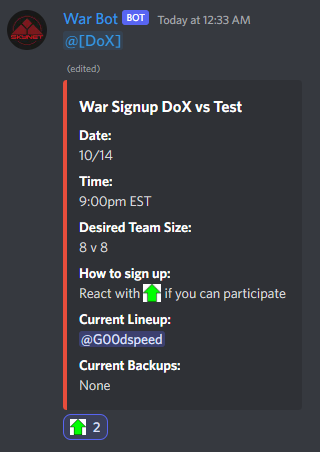

# WarBot
A Discord Bot for clan-wars:

Creates a post pinging the team, and through reactions will create a roster of players.

## Features

* Order is based on first-reaction
* Team size is adjustable
* Any reactions above team size are placed on a backup roster
* Reaction removal will result in loss-of-place
* auto-cleanup with kill reaction
* pings clan members

## Usage

Create a file in the config folder called config.py. Copy the contents of example_config.py to the file and update with values for your guild / channel / role / emojis

The !war command will allow one to set up a war:

The bot will then post and track a message pinging the team and an embed with the details of the lineup:

